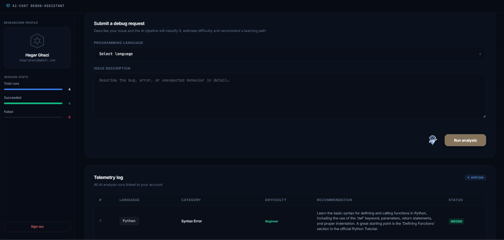

<div align="center">

# ⚡ AI Debug Assistant Platform

### *Classify. Diagnose. Learn.*

A locally-hosted AI debugging pipeline that transforms raw programming issues into structured, actionable intelligence. Describe a bug, a stack trace or unexpected behavior and the system returns a precise error classification, a difficulty assessment and a targeted learning recommendation tailored to close your exact knowledge gap. Built on a local LLM runtime with no cloud dependency, no API keys and no external data transmission. Every analysis run is logged to a personal telemetry dashboard giving you a clear record of your debugging patterns over time.

[](https://python.org)
[](https://fastapi.tiangolo.com)
[](https://ollama.com)
[](https://aistudio.google.com)
[](https://sqlite.org)
[](https://railway.app)
[](LICENSE)

</div>

---

## 🎬 Demo

https://github.com/user-attachments/assets/ba419c24-a7ff-4372-ba87-d06e774ea1d6

---

## 📸 Screenshots



---

## What It Does

Submit any programming issue in natural language — a stack trace, a logic fault, an unexpected runtime behavior. The inference pipeline analyzes the input against a structured prompt schema and returns three outputs: an error classification drawn from ten precisely defined categories, a difficulty rating calibrated to the depth of knowledge required to resolve it, and a targeted learning recommendation scoped to the exact gap the issue exposes — not a generic suggestion, but a specific concept, API, or documentation reference engineered to help you fix the problem and internalize the prevention.

Every run is persisted as a structured record in your personal telemetry log. Across sessions this builds a clear, queryable history of the issues you encounter most, the complexity distribution of your bugs, and the learning path the system has mapped out for you. The full inference stack runs on-device via Ollama locally. When deployed to Railway the system automatically switches to Gemini and no code changes required

---

## ✨ Features

| Feature | Description |
|---|---|
| 🧠 **AI Classification** | Identifies the error type across 10 categories |
| 📊 **Difficulty Rating** | Labels each issue as Beginner, Intermediate or Advanced |
| 📚 **Learning Path** | Returns a specific, actionable recommendation per issue |
| 🗂️ **Telemetry Log** | Tracks every run with full history per user account |
| 🔒 **Secure Auth** | bcrypt password hashing with session-based login |
| 🔀 **Dual AI Backend** | Ollama locally · Gemini on Railway  |
| 📡 **Offline Ready** | Runs fully offline via Ollama with zero cloud dependency |
| 🎨 **Dark UI** | Professional dark-mode dashboard with glassmorphism design |

**Supported error categories:**
Syntax Error · Logic Error · Runtime Exception · Type Error · Scope/Closure Issue · Async/Concurrency Bug · Memory/Resource Leak · API Misuse · Algorithm Issue · Configuration Error

---

## 🛠️ Tech Stack

| Role | Tool | Link |
|---|---|---|
| **Web Framework** | FastAPI | [fastapi.tiangolo.com](https://fastapi.tiangolo.com) |
| **ASGI Server** | Uvicorn | [uvicorn.org](https://uvicorn.org) |
| **Local AI Runtime** | Ollama | [ollama.com](https://ollama.com) |
| **Local AI Model** | Aya Expanse | [ollama.com/library/aya-expanse](https://ollama.com/library/aya-expanse) |
| **Cloud AI** | Gemini 2.5 Flash | [aistudio.google.com](https://aistudio.google.com) |
| **ORM** | SQLAlchemy | [sqlalchemy.org](https://sqlalchemy.org) |
| **Database** | SQLite | [sqlite.org](https://sqlite.org) |
| **Templating** | Jinja2 | [jinja.palletsprojects.com](https://jinja.palletsprojects.com) |
| **Password Hashing** | bcrypt | [pypi.org/project/bcrypt](https://pypi.org/project/bcrypt) |
| **Session Middleware** | Starlette | [starlette.io](https://starlette.io) |
| **Package Manager** | uv | [docs.astral.sh/uv](https://docs.astral.sh/uv) |
| **Cloud Deployment** | Railway | [railway.app](https://railway.app) |
| **Animations** | Lottie Web | [lottiefiles.com](https://lottiefiles.com) |
| **Fonts** | JetBrains Mono + Inter | [jetbrains.com/mono](https://www.jetbrains.com/mono) |

---

## 🤖 Dual AI Backend  (Ollama + Gemini)

This project uses a smart auto-detection system — one `ai_service.py` file handles both backends automatically based on the environment.

```
GEMINI_API_KEY present?
        │
       YES → uses Gemini 2.5 Flash  (Railway / cloud deployment)
        │
        NO  → uses Ollama aya-expanse (your local machine)
```

| Environment | AI Backend | Model | Requires |
|---|---|---|---|
| Local development | Ollama | aya-expanse | Ollama running on `localhost:11434` |
| Railway deployment | Gemini | gemini-2.5-flash | `GEMINI_API_KEY` in Railway variables |

No code changes needed when switching between environments — the system detects and routes automatically.


### Testing your Gemini API key

A dedicated test script is included to verify which Gemini models are available for your API key:

```bash
python test_gemini_model.py
```

Output example:
```
=======================================================
  Gemini Model Availability Test
=======================================================
✅  gemini-2.5-flash              --> working
✅  gemini-2.5-flash-lite         --> working
❌  gemini-2.0-flash              --> 429 RESOURCE_EXHAUSTED
❌  gemini-1.5-flash              --> 404 NOT_FOUND
=======================================================
Use any ✅ model in your ai_service.py
```

---

## 📁 Project Structure

```
AI Debug Assistant Platform/
│
├── main.py                    # App entry point contains all routes and auth logic
├── ai_service.py              # Dual AI backend as Ollama locally, Gemini on Railway
├── models.py                  # SQLAlchemy ORM models (User, ReviewSession)
├── database.py                # DB engine, session factory, get_db dependency
├── test_gemini_model.py       # Utility to test Gemini model availability
├── Procfile                   # Railway deployment command
│
├── templates/
│   ├── index.html             # Main dashboard contains submit form + telemetry log
│   ├── login.html             # Sign in page
│   └── register.html          # Account creation page
│
├── static/
│   ├── css/
│   │   ├── main.css           # Dashboard layout and component styles
│   │   └── auth.css           # Login / register card styles
│   └── assets/
│       └── robot-chat.json    # Lottie animation for the submit button
│
├── media/                     # Project media for README
│   ├── AI-Debug-Platform.png  # Dashboard screenshot
│   └── AI Debug Assistant Video.webm
│
├── .env                       # Environment variables (not committed)
├── .env.example               # Environment variable template (committed)
├── .gitignore                 # Excludes secrets, venv, db, media files
├── database.db                # SQLite database (auto-created on first run)
├── requirements.txt           # Python dependencies
└── pyproject.toml             # Project metadata for uv
```

---

## 🚀 Getting Started

### Prerequisites

- Python **3.11+**
- [**uv**](https://docs.astral.sh/uv) — fast Python package manager
- [**Ollama**](https://ollama.com) — running locally on `localhost:11434`

---

### Installation

**1. Clone the repository**
```bash
git clone https://github.com/Hagar-Ghazi/ai-debug-assistant.git
cd ai-debug-assistant
```

**2. Install dependencies**
```bash
uv pip install -r requirements.txt
```

**3. Configure environment**
```bash
cp .env.example .env
```

Open `.env` and set your values:
```env
SESSION_SECRET=your-strong-secret-key-here
GEMINI_API_KEY=                              # leave empty to use Ollama locally
```

Generate a secure session key:
```bash
python -c "import secrets; print(secrets.token_hex(32))"
```

**4. Pull the AI model**
```bash
ollama pull aya-expanse
```

**5. Start the server**
```bash
uvicorn main:app --reload
```

**6. Open in your browser**
```
http://localhost:8000
```

---


## ☁️ Deploy to Railway

### Step 1 — Push to GitHub
```bash
git add .
git commit -m "initial commit"
git push origin main
```


### Step 2 — Create Railway project

1. Go to [railway.app](https://railway.app) and sign in with GitHub
2. Click **New Project** --> **Deploy from GitHub repo**
3. Select your repository
4. Railway auto-detects Python and starts the build


### Step 3 — Set environment variables

In your Railway project dashboard go to **Variables** and add:

| Variable | Value |
|---|---|
| `SESSION_SECRET` | A strong random string |
| `GEMINI_API_KEY` | Your Gemini API key from [aistudio.google.com](https://aistudio.google.com/app/apikey) |

### Step 4 — Get your live URL

Railway generates a public URL automatically:
```
https://your-app-name.up.railway.app
```

Once `GEMINI_API_KEY` is set the app automatically switches from Ollama to Gemini and no code changes needed

### Railway Free Tier

| Resource | Limit |
|---|---|
| Monthly hours | 500 hours |
| RAM | 512 MB |
| Disk | 1 GB |
| Sleep on inactivity | No |

---

## 🔑 Environment Variables

| Variable | Required | Where | Description |
|---|---|---|---|
| `SESSION_SECRET` | Yes | Local + Railway | Signs and encrypts session cookies |
| `GEMINI_API_KEY` | Railway only | Railway | Activates Gemini backend and be empty locally for Ollama |

---

## 📡 API Routes

| Method | Route | Description |
|---|---|---|
| `GET` | `/` | Dashboard (requires login) |
| `GET` | `/login` | Login page |
| `POST` | `/login` | Authenticate user |
| `GET` | `/register` | Registration page |
| `POST` | `/register` | Create new account |
| `GET` | `/logout` | Clear session and redirect |
| `POST` | `/submit` | Submit issue for AI analysis |
| `GET` | `/docs` | Auto-generated Swagger UI (FastAPI) |

---

## 🔬 How the AI Pipeline Works

```
User submits issue
       ↓
FastAPI receives language + description
       ↓
ai_service.py detects environment
       ↓
  Local → Ollama (aya-expanse)
  Railway → Gemini (gemini-2.5-flash)
       ↓
Response parsed and validated as JSON
       ↓
{ category, difficulty, recommendation }
       ↓
Saved to SQLite as ReviewSession row
       ↓
Dashboard renders updated telemetry log
```

The model is instructed to return only valid JSON — no markdown, no explanation. A regex-based fence stripper handles any non-compliant responses before parsing.

---

## 🔐 Security Notes

- Passwords are hashed with **bcrypt** before storage and plaintext is never saved
- Sessions are signed with a secret key via **Starlette SessionMiddleware**
- Locally the app runs fully offline and no user data reaches external servers
- For production: use a strong `SESSION_SECRET` run behind HTTPS and consider rate limiting the `/submit` route

---

<div align="center">
  Built with focus · Runs offline · Deploys to the cloud
</div>
